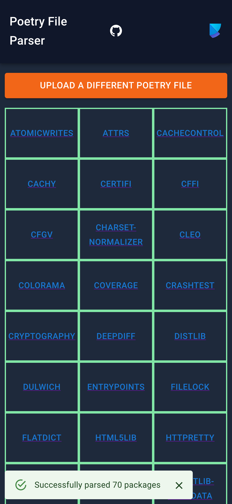
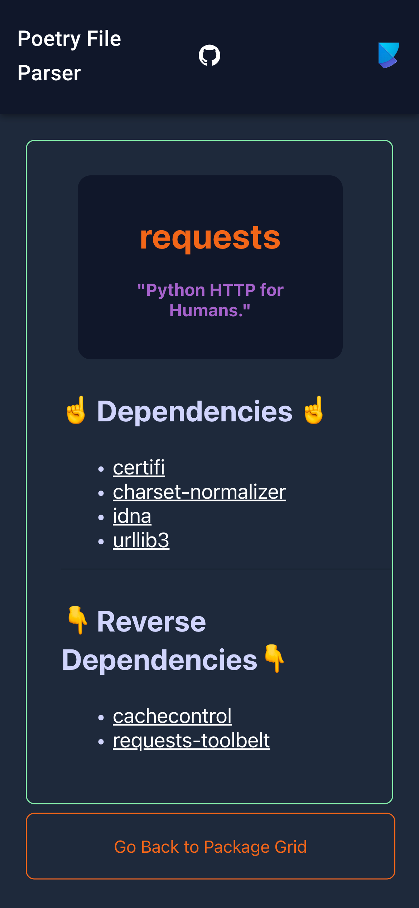

# Poetry File Parser Website

This [React](https://reactjs.org/) web application allows users to upload a Python [Poetry](https://python-poetry.org/) dependency file, which gets parsed and visualized. The app displays a package grid, and clicking on a package will navigate to a package view showing clickable dependencies and reverse-dependencies, allowing users to click through the dependency tree.

<center>
    <a href="http://wwww.poetry-parser.com">
        <b>poetry-parser.com</b>
    </a>
    <span>
        
        
    </span>
</center>

## Installation

If not already done, install [npm](https://docs.npmjs.com/downloading-and-installing-node-js-and-npm).

Then, install the app from within the root folder of this git repo using this command:

```bash
npm install
```

To run the app locally:

```bash
npm start
```

## Testing

To run the [Jest](https://jestjs.io/) tests:

```bash
npm test
```
